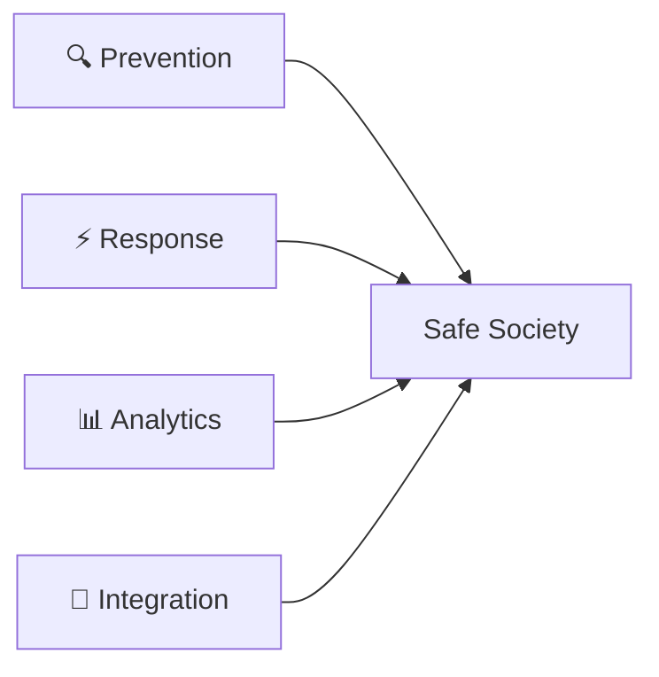

<div align="right">

[](README.md)
[](README.uz.md)

</div>

<div align="center">


# Safe City Systems Development Center
## Ministry of Internal Affairs of the Republic of Uzbekistan

[](https://www.gov.uz)
[](https://mvd.uz)
[](https://digitaleconomy.uz)
[](https://mvd.uz)
[](#development-department)

---

### 📊 Platform Statistics


</div>

---

## 🎯 About Us

**In accordance with the Presidential Decree of the Republic of Uzbekistan dated September 28, 2023** *"On additional measures to improve the unified integrated system 'Safe City'"* the state institution "Center for Assistance to Public Order 'Safe City' of the Ministry of Internal Affairs" was renamed to **"Safe City Systems Development Center of the Ministry of Internal Affairs"**.

The decree approved the concept of creating and developing "Safe City" systems, as well as targeted annual programs for the creation and development of these systems throughout the republic.

> 💡 **Our transformation** marks a strategic shift from operational support to comprehensive systems development, positioning us at the forefront of public safety innovation in Central Asia.

---

## 🌟 Mission & Role

The implementation of the **Safe City project** is aimed at creating a solid foundation for the stable and consistent development of Uzbekistan in the field of information and communication technologies and its broad integration into the global community. 

**The level of seriousness and commitment of the Center** in implementing planned activities plays a key role in ensuring the prosperity of the country and the well-being of its citizens.

### 🎯 Strategic Objectives



---

## 🚀 Reform Goals

<table>
<tr>
<td width="50%" valign="top">

### 🛡️ Public Safety Enhancement
Transition to a **proactive model** of maintaining order with predictive capabilities and early warning systems

</td>
<td width="50%" valign="top">

### ⚖️ Comprehensive Crime Fighting
Systematic approach to **prevention and detection** of offenses using data-driven methodologies

</td>
</tr>
<tr>
<td width="50%" valign="top">

### 🌪️ Emergency Prevention
Minimizing consequences of threats with emphasis on **forecasting and prevention** rather than reactive response

</td>
<td width="50%" valign="top">

### 🤖 Digitalization & AI
Application of modern digital and **intelligent systems**, reducing human factor influence

</td>
</tr>
</table>

---

## 📋 Core Responsibilities

### 🔗 System Integration & Interoperability
- 📹 Video surveillance networks across all regions
- 🚨 Automated violation detection and recording
- 🏢 Critical infrastructure protection systems
- ⚠️ Real-time threat identification and alerts
- 🧠 Intelligent analytical sensor deployment
- 🛡️ Crime prevention through predictive analytics

### 🏙️ Public Safety & Emergency Management
- 💼 Advanced ICT implementation for public safety
- 📱 Digital transformation of safety processes
- 🎓 Modern methodologies and best practices
- 🔄 Continuous improvement and innovation

### 🧮 Situational & Analytical Systems
- 🗺️ Regional intelligent monitoring centers
- 📈 Development of situational awareness infrastructure
- 🔍 Real-time data aggregation and analysis
- 🎯 Decision support systems for authorities

### ⚙️ Operation & Maintenance
- 🚀 Implementation and deployment of Safe City systems
- 🛠️ 24/7 technical support and maintenance
- 👥 Training and capacity building programs
- 📚 Knowledge transfer to local authorities and National Guard

### 🆘 Population & Territory Protection
- 🌊 Natural disaster response systems
- 🏭 Industrial hazard monitoring
- 🚒 Fire safety infrastructure
- 🚗 Traffic safety management
- 🌱 Environmental monitoring
- 🏘️ Utilities and smart city infrastructure

---

## 👨‍💻 Development Department

<div align="center">

### 🎨 Welcome to our official development hub

We design, develop, and maintain digital platforms and services for the **Safe City ecosystem**

</div>

#### 🏗️ Platform Solutions
- 🔷 Microservices architecture
- 🔗 Integration with government information systems
- 🌐 API gateways and service mesh
- ☁️ Cloud-native applications
- 📦 Containerization and orchestration

#### 🤖 Analytics & AI
- 👁️ Advanced video analytics
- 🎯 Event recognition and classification
- 🧠 Behavioral pattern analysis
- 📊 Situational awareness centers
- 🔮 Predictive modeling

#### 🔐 Reliability & Scalability
- 🏗️ Fault-tolerant architectures
- 👀 System observability and monitoring
- 🛡️ Security and compliance frameworks
- ⚡ High-availability design patterns
- 📈 Auto-scaling capabilities

#### 🔄 Development Lifecycle
- 🚀 CI/CD pipelines
- ✅ Automated testing frameworks
- 📊 Quality assurance processes
- 🆘 Technical support infrastructure
- 🔧 SRE (Site Reliability Engineering) practices

---

## 💻 Technology Stack

<div align="center">

### 📡 Data Collection & Processing


### 🧠 Intelligent Analysis


### 🔗 Integration Layer


### 🔐 Information Security


</div>

---

## 💎 Core Principles

<div align="center">

| 🔒 Security First | 💾 Data as Asset | ⚡ Scalability | 🎯 Result-Oriented |
|:---:|:---:|:---:|:---:|
| Security by design in every component | Data-driven decision making | Built to scale horizontally | Focus on measurable outcomes |
| Zero-trust architecture | Data quality and governance | High availability guaranteed | Service excellence |

</div>

---

## 📈 Impact & Achievements

```
┌─────────────────────────────────────────────────────────────┐
│                    SYSTEM PERFORMANCE                        │
├─────────────────────────────────────────────────────────────┤
│ Crime Prevention        ████████████████░░░░  78% increase   │
│ Response Time           ██████████████████░░  89% faster     │
│ Incident Detection      █████████████████░░░  85% automated  │
│ System Integration      ████████████████████  95% complete   │
│ User Satisfaction       █████████████████░░░  87% positive   │
└─────────────────────────────────────────────────────────────┘
```

---

## 📞 Contact & Collaboration

<div align="center">

### 🤝 Partner with Us

For project collaboration and integrations, please use official channels of the **Ministry of Internal Affairs** and the **Safe City Development Center**.

This repository is dedicated to publishing open artifacts, documentation, and fostering transparency in our development processes.

### 📬 Official Channels
🌐 [Ministry of Internal Affairs](https://mvd.uz) | 🏛️ [Government Portal](https://gov.uz)

---

### 🌐 Connect With Us

[](https://mvd.uz)
[](mailto:info@mvd.uz)
[](https://t.me/mvd_uz)

</div>

---

<div align="center">

### 🏆 Making Uzbekistan Safer Through Technology

**Innovative Solutions • Data-Driven Insights • Proactive Safety**

---

© 2023-2024 Safe City Systems Development Center, Ministry of Internal Affairs of the Republic of Uzbekistan

*Building tomorrow's security infrastructure today*

</div>
