<div align="right">

[](README.md)
[](README.uz.md)

</div>

<div align="center">


# "Xavfsiz shahar" tizimlari rivojlantirish markazi
## O'zbekiston Respublikasi Ichki ishlar vazirligi

[](https://www.gov.uz)
[](https://mvd.uz)
[](https://digitaleconomy.uz)
[](https://mvd.uz)
[](#dasturlash-bo'limi)

---

### 📊 Platforma Statistikasi


</div>

---

## 🎯 Biz Haqimizda

**O'zbekiston Respublikasi Prezidentining 2023-yil 28-sentabrdagi** *"Yagona integratsiyalashgan «Xavfsiz shahar» tizimini takomillashtirish bo'yicha qo'shimcha choralar to'g'risida"gi* qaroriga muvofiq "Ichki ishlar vazirligi "Xavfsiz shahar" jamoat tartibini ta'minlash markazi" davlat muassasasi **"Ichki ishlar vazirligi "Xavfsiz shahar" tizimlari rivojlantirish markazi"** deb qayta nomlandi.

Qaror bilan "Xavfsiz shahar" tizimlarini yaratish va rivojlantirish konsepsiyasi tasdiqlandi, shuningdek, respublikada ushbu tizimlarni yaratish va rivojlantirish bo'yicha maqsadli yillik dasturlar ishlab chiqildi.

> 💡 **Bizning transformatsiyamiz** operatsion qo'llab-quvvatlashdan to'liq tizimlarni rivojlantirishga strategik o'tishni bildiradi va bizni Markaziy Osiyo jamoat xavfsizligi innovatsiyalarining oldingi saflarida joylashtiradi.

---

## 🌟 Missiya va Rol

**"Xavfsiz shahar" loyihasini amalga oshirish** O'zbekistonning axborot-komunikatsiya texnologiyalari sohasida barqaror va izchil rivojlanishi uchun mustahkam poydevor yaratish va uning jahon hamjamiyatiga keng integratsiyalashuviga qaratilgan.

**Markaz tomonidan rejalashtirilgan tadbirlarni amalga oshirishda jiddiylik va g'ayrat darajasi** mamlakat farovonligini va fuqarolar farovonligini ta'minlashda muhim rol o'ynaydi.

### 🎯 Strategik Maqsadlar

```mermaid
graph LR
    A[🔍 Oldini Olish] --> E[Xavfsiz Jamiyat]
    B[⚡ Javob Berish] --> E
    C[📊 Analitika] --> E
    D[🤝 Integratsiya] --> E
```



---

## 🚀 Islohotlar Maqsadlari

<table>
<tr>
<td width="50%" valign="top">

### 🛡️ Jamoat Xavfsizligini Oshirish
Bashoratli imkoniyatlar va erta ogohlantirish tizimlari bilan tartibni ta'minlashning **proaktiv modeli**ga o'tish

</td>
<td width="50%" valign="top">

### ⚖️ Jinoyatchilikka Qarshi Kompleks Kurash
Ma'lumotlarga asoslangan metodologiyalar yordamida huquqbuzarliklarning **oldini olish va aniqlash**ga tizimli yondashuv

</td>
</tr>
<tr>
<td width="50%" valign="top">

### 🌪️ Favqulodda Vaziyatlarning Oldini Olish
Reaktiv javobdan ko'ra **prognozlash va oldini olish**ga e'tibor qaratib, tahdidlar oqibatlarini minimallashtirish

</td>
<td width="50%" valign="top">

### 🤖 Raqamlashtirish va AI
Zamonaviy raqamli va **intellektual tizimlar**ni qo'llash, inson omili ta'sirini kamaytirish

</td>
</tr>
</table>

---

## 📋 Asosiy Vazifalar

### 🔗 Tizimlarni Integratsiyalash va O'zaro Ta'sir
- 📹 Barcha viloyatlarda video kuzatuv tarmoqlari
- 🚨 Huquqbuzarliklarni avtomatik aniqlash va qayd etish
- 🏢 Muhim infratuzilmalarni himoya qilish tizimlari
- ⚠️ Real vaqtda tahdidlarni aniqlash va ogohlantirishlar
- 🧠 Intellektual analitik sensorlarni joylashtirish
- 🛡️ Bashoratli analitika orqali jinoyatchilikning oldini olish

### 🏙️ Jamoat Xavfsizligi va Favqulodda Vaziyatlarni Boshqarish
- 💼 Jamoat xavfsizligi uchun ilg'or AKT joriy etish
- 📱 Xavfsizlik jarayonlarini raqamli transformatsiya qilish
- 🎓 Zamonaviy metodologiyalar va eng yaxshi amaliyotlar
- 🔄 Doimiy takomillashtirish va innovatsiyalar

### 🧮 Situatsion va Analitik Tizimlar
- 🗺️ Hududiy intellektual monitoring markazlari
- 📈 Situatsion ogohlik infratuzilmasini rivojlantirish
- 🔍 Real vaqtda ma'lumotlarni yig'ish va tahlil qilish
- 🎯 Hokimiyat uchun qarorlarni qo'llab-quvvatlash tizimlari

### ⚙️ Ekspluatatsiya va Texnik Xizmat Ko'rsatish
- 🚀 Xavfsiz shahar tizimlarini joriy etish va o'rnatish
- 🛠️ 24/7 texnik qo'llab-quvvatlash va xizmat ko'rsatish
- 👥 Ta'lim va salohiyatni oshirish dasturlari
- 📚 Mahalliy hokimiyat va Milliy gvardiyaga bilim uzatish

### 🆘 Aholini va Hududni Himoya Qilish
- 🌊 Tabiiy ofatlarga javob berish tizimlari
- 🏭 Sanoat xavflarini monitoring qilish
- 🚒 Yong'in xavfsizligi infratuzilmasi
- 🚗 Yo'l harakati xavfsizligini boshqarish
- 🌱 Ekologik monitoring
- 🏘️ Kommunal xizmatlar va aqlli shahar infratuzilmasi

---

## 👨‍💻 Dasturlash Bo'limi

<div align="center">

### 🎨 Bizning rasmiy ishlab chiqish markazimizga xush kelibsiz

Biz **Xavfsiz shahar ekotizimi** uchun raqamli platformalar va xizmatlarni loyihalashtiramiz, ishlab chiqamiz va qo'llab-quvvatlaymiz

</div>

#### 🏗️ Platforma Yechimlari
- 🔷 Mikroservislar arxitekturasi
- 🔗 Davlat axborot tizimlari bilan integratsiya
- 🌐 API shlyuzlari va xizmat to'ri
- ☁️ Bulutga asoslangan ilovalar
- 📦 Konteynerlashtirish va orkestratsiya

#### 🤖 Analitika va AI
- 👁️ Ilg'or video analitika
- 🎯 Hodisalarni aniqlash va tasniflash
- 🧠 Xulq-atvor naqshlarini tahlil qilish
- 📊 Situatsion ogohlik markazlari
- 🔮 Bashoratli modellashtirish

#### 🔐 Ishonchlilik va Kengayish
- 🏗️ Nosozliklarga chidamli arxitekturalar
- 👀 Tizimni kuzatish va monitoring
- 🛡️ Xavfsizlik va muvofiqlik ramkalari
- ⚡ Yuqori mavjudlik dizayn naqshlari
- 📈 Avtomatik kengayish imkoniyatlari

#### 🔄 Ishlab Chiqish Hayot Tsikli
- 🚀 CI/CD quvurlari
- ✅ Avtomatlashtirilgan test ramkalari
- 📊 Sifatni ta'minlash jarayonlari
- 🆘 Texnik qo'llab-quvvatlash infratuzilmasi
- 🔧 SRE (Sayt Ishonchliligi Muhandisligi) amaliyotlari

---

## 💻 Texnologiya To'plami

<div align="center">

### 📡 Ma'lumotlarni Yig'ish va Qayta Ishlash


### 🧠 Intellektual Tahlil


### 🔗 Integratsiya Qatlami


### 🔐 Axborot Xavfsizligi


</div>

---

## 💎 Asosiy Tamoyillar

<div align="center">

| 🔒 Xavfsizlik Birinchi | 💾 Ma'lumot - Aktiv | ⚡ Kengayish | 🎯 Natijaga Yo'naltirilgan |
|:---:|:---:|:---:|:---:|
| Har bir komponentda xavfsizlik dizayni | Ma'lumotlarga asoslangan qaror qabul qilish | Gorizontal kengayish uchun qurilgan | O'lchanadigan natijalarga e'tibor |
| Nol-ishonch arxitekturasi | Ma'lumotlar sifati va boshqaruvi | Yuqori mavjudlik kafolatlangan | Xizmat mukammalligi |

</div>

---

## 📈 Ta'sir va Yutuqlar

```
┌─────────────────────────────────────────────────────────────┐
│                  TIZIM SAMARADORLIGI                         │
├─────────────────────────────────────────────────────────────┤
│ Jinoyat Oldini Olish   ████████████████░░░░  78% o'sish      │
│ Javob Berish Vaqti     ██████████████████░░  89% tezroq      │
│ Hodisalarni Aniqlash   █████████████████░░░  85% avtomatik   │
│ Tizim Integratsiyasi   ████████████████████  95% tugallangan │
│ Foydalanuvchi Qoniq.   █████████████████░░░  87% ijobiy      │
└─────────────────────────────────────────────────────────────┘
```

---

## 📞 Aloqa va Hamkorlik

<div align="center">

### 🤝 Biz Bilan Hamkorlik Qiling

Loyiha hamkorligi va integratsiyalar uchun **Ichki ishlar vazirligi** va **Xavfsiz shahar rivojlantirish markazi**ning rasmiy kanallaridan foydalaning.

Ushbu repozitoriya ochiq artifaktlar, hujjatlar e'lon qilish va ishlab chiqish jarayonlarimizda shaffoflikni ta'minlashga bag'ishlangan.

### 📬 Rasmiy Kanallar
🌐 [Ichki ishlar vazirligi](https://mvd.uz) | 🏛️ [Hukumat portali](https://gov.uz)

---

### 🌐 Biz Bilan Bog'laning

[](https://mvd.uz)
[](mailto:info@mvd.uz)
[](https://t.me/mvd_uz)

</div>

---

<div align="center">

### 🏆 Texnologiya Orqali O'zbekistonni Xavfsizroq Qilish

**Innovatsion Yechimlar • Ma'lumotlarga Asoslangan Tahlil • Proaktiv Xavfsizlik**

---

© 2023-2024 "Xavfsiz shahar" tizimlari rivojlantirish markazi, O'zbekiston Respublikasi Ichki ishlar vazirligi

*Bugungi kunda ertangi xavfsizlik infratuzilmasini quramiz*

</div>

